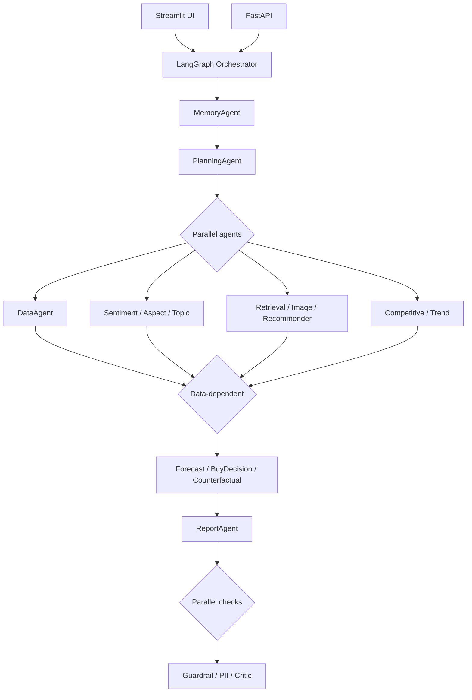

# 🧠 Multi-Agent E-Commerce Analyst

AI-powered product intelligence platform: 18-agent orchestration, hybrid RAG, aspect-level sentiment, price forecasting, and automated evaluation gates.

A production system that analyzes e-commerce products using LLM-driven agents, retrieves grounded evidence from ~50K reviews, and produces a structured, fact-checked decision report.

---

## 🚀 Overview

- 🔍 Hybrid retrieval (dense + BM25 + reranking) over review embeddings
- 💬 Global, aspect-level, and time-trend sentiment analysis
- 🧠 Price-tier forecasting and buy-now/wait recommendations
- 📊 Structured reports, independently fact-checked by a critic agent
- ⚙️ 18 agents, fanned out in parallel where no dependency exists
- 🧪 Automated retrieval/generation/routing evaluation, gating CI on regression

---

## ✨ Features

### 🔹 Multi-Agent Architecture

| Agent | Responsibility |
|-------|----------------|
| MemoryAgent | Recalls prior history for this product |
| PlanningAgent | LLM decides which agents this query needs |
| DataAgent | Fetches price, category, features |
| SentimentAgent | Overall review sentiment |
| AspectSentimentAgent | Sentiment per feature (battery, sound, comfort...) |
| TopicAgent | Extracts themes and pain points |
| RetrievalAgent | Hybrid RAG over review embeddings |
| ImageRetrievalAgent | Visual similarity matching |
| RecommenderAgent | Related/alternative products |
| SummarizationAgent | Condenses evidence into a summary |
| ForecastAgent | Predicts price tier |
| CompetitiveAgent | Compares against competitor products |
| TrendAgent | Time-based sentiment patterns |
| CounterfactualAgent | Suggests product improvements |
| BuyDecisionAgent | Buy-now vs. wait recommendation |
| ReportAgent | Writes the final structured report |
| GuardrailAgent | Checks predicted price tier matches report text |
| PIIGuardrailAgent | Regex-redacts emails/phone numbers |
| CriticAgent | Independently scores the report for hallucination |

Agents with no shared dependency run concurrently; a small data-dependent group (forecast, buy-decision, counterfactual) waits on `DataAgent`'s output first.

---

## 🧩 System Architecture



Streamlit and the API are separate entry points into the same orchestrator, not chained — Streamlit does not call the API over HTTP.

---

## 🛠️ Tech Stack

### 🔧 Backend
- FastAPI, Python 3.12, Pydantic
- LangGraph orchestration (parallel + conditional fan-out)
- OpenTelemetry instrumentation

### 🎨 Frontend
- Streamlit — real-time analysis dashboard, RBAC-gated admin views

### 🤖 AI / ML
- LLM-based agents (OpenAI Responses API)
- Hybrid RAG: dense + BM25 + cross-encoder reranking (Qdrant)
- MLflow experiment tracking
- Aspect sentiment: zero-shot classification or LLM backend
- Model Context Protocol — exposed as a server, and as a client for external price lookups

### ☁️ Infrastructure
- Docker (verified, live deployment)
- Kubernetes manifests (see caveat below)
- Redis (caching), Qdrant (vector DB)
- GitHub Actions CI/CD, gated by the evaluation suite below

---

## 🧪 Evaluation & CI Gate

Three evaluators run against curated eval sets and log every run to a persistent history:

```bash
python -m app.evaluation.evaluators.retrieval_evaluator
python -m app.evaluation.evaluators.agentic_evaluator
python -m app.evaluation.evaluators.generation_evaluator
```

Results are visible in Streamlit's eval dashboard, with trend lines across runs. CI blocks a deploy if a change regresses retrieval quality, routing accuracy, or hallucination rate.

Standard unit tests:
```bash
pytest -q
```

---

## 📦 Project Structure

```
app/
  ├── agents/            # 18 agent implementations + orchestrator
  ├── services/           # aspect, RAG, buy-decision business logic
  ├── rag/                  # Qdrant index build, retrieval, chunking
  ├── prompts/                # system/user prompt templates, kept out of code
  ├── models/                   # LLM client, embeddings, forecast model
  ├── evaluation/                 # evaluators, metrics, eval history, CI runner
  ├── memory/                       # per-product persistent history (SQLite)
  ├── mcp/                            # MCP server
  ├── config/                          # settings, paths
  ├── observability/                    # tracing
  ├── api/
  │   └── main.py
  └── ui/
      ├── streamlit_app.py
      ├── auth.py                        # RBAC
      └── eval_dashboard.py

k8s/       # see caveat below
tests/
```

---

## 🐳 Running Locally (Docker Compose)

```bash
docker compose up -d --build
```

| Service | URL |
|---------|-----|
| API | http://localhost:8000 |
| Streamlit UI | http://localhost:8501 |
| Eval dashboard | http://localhost:8501/eval_dashboard |
| Grafana | http://localhost:3001 |
| Redis | localhost:6379 |
| Qdrant | http://localhost:6333 |

---

## ☸️ Kubernetes

Manifests exist in `k8s/` but predate the LangGraph orchestrator, MCP, and RBAC additions — treat as a deployment target to update, not a verified current one.

```bash
kubectl apply -f k8s/
```

---

## 🔐 Environment Variables

**ConfigMap**

| Variable | Description |
|----------|-------------|
| LOG_LEVEL | Logging verbosity |
| REDIS_URL | Redis connection URL |
| QDRANT_URL | Qdrant connection URL |
| ADMIN_API_KEYS | RBAC admin access |
| OTEL_* | OpenTelemetry config |

**Secrets**

| Variable | Description |
|----------|-------------|
| OPENAI_API_KEY | OpenAI API key |
| QDRANT_API_KEY | Qdrant API key |

---

## 📊 Observability

- OpenTelemetry tracing across all agents
- Prometheus metrics + Grafana dashboards
- Separate, periodic eval-history tracking (distinct from live traffic metrics)

---

## 🤝 Contributing

Pull requests welcome. Open an issue first for major changes.

## 📄 License

MIT License.